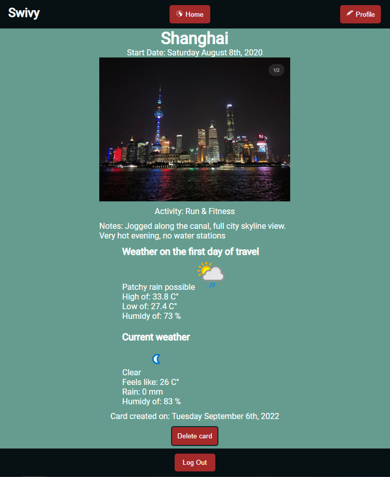

# Swivy - A quick travel card creator 

Where do you look when you want to remind yourself of the mouth-watering pizza that corner store in Venice served you? What about the walk that led you to the beautiful city skyline of Shanghai after hours of roaming? Is it in a notepad you bought that is now misplaced? Or in a folder of hundreds of photos that you have to scroll back and forth in to find? Well, look no further, *Swivy* has got you covered.

---
## Goal

Swivy's goal is to compile all of *your* filtered information into the same place, while providing you with the necessary tools to track details that *you* want to remember years down the line. This website allows you to keep track of the most crucial information from your travels in a logical and quick to use method.
## Features
Log in, click on the **+** button and you will be on your way to creating your first *Travel Card*! Each travel card will require at minimum: a destination and travel dates. These two pieces of information will help you sort your cards once you visit your homepage.

Do you want to add more information? The travel card creation page allows optional criteria such as: 
- logging an activity
- uploading a photo
- even adding your own notes! 

Finally, you can keep an eye out on the forecast trends of your travel dates with the simple addition of the nearest city. Here is a sample of a travel card:

---
## Swivy is a website that uses the MERN stack:
- MongoDB - A document databsase that stores each unique user and their travel cards
- Express.js - A webframework for Node.js, used in back-end
- React.js - A client-side JavaScript framework that allows smooth webpage transitions and an easy user experience
- Node.js - A JavaScript based, open source server environment that adds, deletes and modifies data in the MongoDB

## APIs involved
Swivy uses the power of **Auth0** - (https://auth0.com/) to verify users via their google accounts. In a day and age where your information is valuable, Swivy only requires your google email for verification and use of the website.

The weather data is powered by Weather API - (https://www.weatherapi.com/) and renders accurate historical weather, as well as the current forecast of a specified city. 

Images uploaded to Swivy are saved in a cloud database, Cloudinary - (https://cloudinary.com/) and returns shows off your media in each travel card.

---
## Created by:
Bernard Li - https://github.com/Bernard-Li 

*Swivy* - is a Concordia Web Development Bootcamp final project, soon to be hosted on GitPages for all to use.

